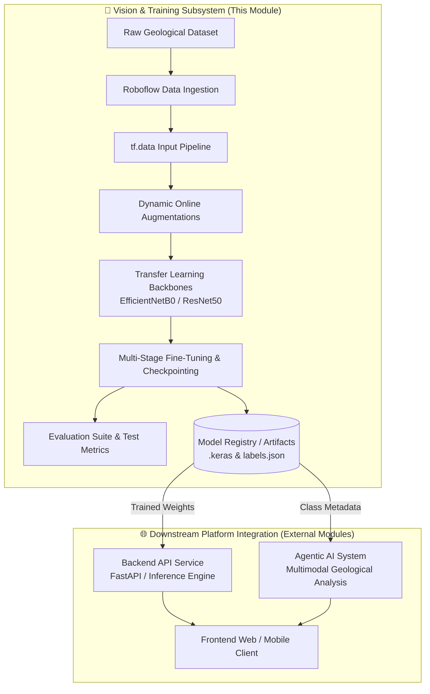
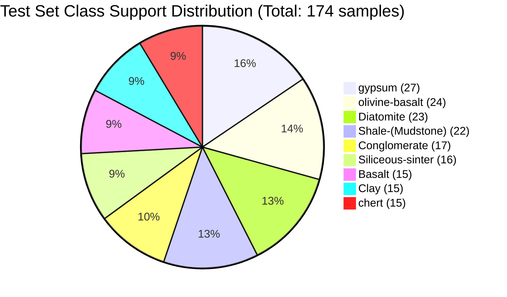

# 🪨 Geological Rock Classification — CV & Model Training Subsystem

[](https://www.python.org/)
[](https://tensorflow.org/)
[](https://keras.io/)
[](https://github.com/astral-sh/uv)
[](LICENSE)
[](https://universe.roboflow.com/william-cwsr-8jizi/rock-clasfication)

> **Subsystem Context**: This repository represents the **Computer Vision & Model Training Core** within a larger multi-tiered architecture. It is responsible for dataset ingestion, dynamic data augmentations, transfer learning model training, hyperparameter benchmarking, out-of-sample evaluation, and artifact generation (`.keras` weights, classification schemas, and performance reports) consumed by downstream **Backend API Services**, **Agentic Decision Systems**, and the **User Frontend**.

---

## 📑 Table of Contents

- [System Architecture & Module Role](#-system-architecture--module-role)
- [Dataset Architecture & Classes](#-dataset-architecture--classes)
- [Data Augmentation & Preprocessing Pipeline](#-data-augmentation--preprocessing-pipeline)
- [Model Architectures & Fine-Tuning Strategies](#-model-architectures--fine-tuning-strategies)
- [Experimental Benchmarks & Results](#-experimental-benchmarks--results)
- [Best Model In-Depth Evaluation](#-best-model-in-depth-evaluation)
- [Geological Error Analysis & Domain Insights](#-geological-error-analysis--domain-insights)
- [Downstream Integration Interface](#-downstream-integration-interface)
- [Module Structure](#-module-structure)
- [Setup & Reproduction Guide](#-setup--reproduction-guide)
- [Evaluation & Standalone Inference](#-evaluation--standalone-inference)
- [License & Acknowledgments](#-license--acknowledgments)

---

## 🏛️ System Architecture & Module Role

In the broader multi-service geological analysis platform, this module functions as the **offline/continuous machine learning pipeline**:



### Module Responsibilities:
1. **Data Ingestion & Augmentation**: Cleanly streaming and dynamically augmenting field imagery without GPU starvation.
2. **Model Engineering & Transfer Learning**: Benchmarking convolutional backbones against domain-specific lithological targets.
3. **Artifact Export**: Producing serialized Keras weights (`models/experiment_XX.keras`), integer-to-class mappings (`models/labels.json`), and comprehensive evaluation telemetry (`reports/*.json`).

---

## 📊 Dataset Architecture & Classes

The geological dataset is curated from [Roboflow Universe: Rock Classification](https://universe.roboflow.com/william-cwsr-8jizi/rock-clasfication) and contains **4,212 high-resolution geological specimens** divided across 3 canonical splits:

| Split | Image Count | Percentage | Role in Pipeline |
| :--- | :---: | :---: | :--- |
| **Train** | **3,687** | 87.5% | Feature extraction and backpropagation |
| **Validation** | **351** | 8.3% | Checkpoint selection, learning rate monitoring & early stopping |
| **Test** | **174** | 4.1% | Strict out-of-sample generalization benchmark |
| **Total** | **4,212** | 100.0% | Multi-class geological rock classification |

### Target Lithologies (9 Classes)

```json
{
  "0": "Basalt",
  "1": "Clay",
  "2": "Conglomerate",
  "3": "Diatomite",
  "4": "Shale-(Mudstone)",
  "5": "Siliceous-sinter",
  "6": "chert",
  "7": "gypsum",
  "8": "olivine-basalt"
}
```

* **Basalt (Igneous - Extrusive)**: Aphanitic, dark-colored mafic volcanic rock dominated by pyroxene and plagioclase.
* **Clay (Sedimentary - Argillaceous)**: Fine-grained hydrous aluminium phyllosilicates, plastic when hydrated.
* **Conglomerate (Sedimentary - Clastic)**: Coarse-grained matrix cementing rounded pebbles and cobbles.
* **Diatomite (Sedimentary - Biogenic)**: High-porosity, chalk-like siliceous rock derived from fossilized diatom frustules.
* **Shale-(Mudstone) (Sedimentary - Clastic)**: Fine-grained, fissile, laminated rock formed from consolidated clay and silt.
* **Siliceous-sinter (Sedimentary - Chemical)**: Porous, low-density opaline silica precipitated around hydrothermal hot springs.
* **Chert (Sedimentary - Chemical/Biogenic)**: Microcrystalline quartz characterized by extreme hardness and conchoidal fractures.
* **Gypsum (Sedimentary - Evaporite)**: Soft sulfate mineral ($CaSO_4 \cdot 2H_2O$), showing fibrous, crystalline, or alabaster morphology.
* **Olivine-Basalt (Igneous - Mafic/Ultramafic)**: Basaltic groundmass rich in distinctive vitreous olive-green olivine phenocrysts.

---

## 🔄 Data Augmentation & Preprocessing Pipeline

Geological field photos present extreme variance in lighting, angle, scale, and mineral weathering. To enforce robust invariant feature representations, a two-phase augmentation and input streaming pipeline was built:

### 1. Offline Ingestion (Roboflow Preprocessing)
- **EXIF Stripping & Auto-Orientation**: Ensures consistent upright orientation across varying camera sensors.
- **Dimensional Normalization**: Resized to $640 \times 640$ pixels.
- **Offline Dataset Expansion**: 3x augmentation set including horizontal flips (50%), random crops (0–20%), random shear ($\pm 10^\circ$), brightness variation ($\pm 15\%$), and salt-and-pepper noise ($0.1\%$).

### 2. Real-Time Online Augmentation (`training/transforms.py`)
Augmentations are applied dynamically on GPU tensors during training inside `tf.data`:

```python
augmentation_layer = keras.Sequential([
    keras.layers.RandomFlip("horizontal"),
    keras.layers.RandomRotation(factor=0.055),           # ±20° rotation
    keras.layers.RandomZoom(height_factor=(-0.15, 0.15)), # ±15% zoom
    keras.layers.RandomBrightness(factor=0.10),          # ±10% brightness
    keras.layers.RandomContrast(factor=0.10),            # ±10% contrast
], name="augmentation")
```

### 3. High-Throughput `tf.data` Pipeline (`training/dataset.py`)
- **Asynchronous IO**: `tf.data.Dataset.from_tensor_slices` mapping file paths and one-hot ground truths.
- **Parallel Image Decode & Resize**: Fast JPEG decoding and resizing to $224 \times 224 \times 3$ uint8 tensors.
- **Dynamic Shuffling & Batching**: Shuffled per epoch with batch size $16$.
- **Model-Aware Preprocessing**: Preprocessed using architecture-specific scaling (`preprocess_input` for EfficientNet / ResNet).
- **GPU Prefetching**: Memory-pipelined via `tf.data.AUTOTUNE` to eliminate I/O blocking.

---

## 🏗️ Model Architectures & Fine-Tuning Strategies

All models utilize ImageNet-1k pretrained weights coupled with a custom classification top:
$$\text{Input } (224 \times 224 \times 3) \longrightarrow \text{Pretrained Backbone} \longrightarrow \text{GlobalAveragePooling2D} \longrightarrow \text{Dropout}(p) \longrightarrow \text{Dense}(9, \text{softmax})$$

Four systematically designed transfer learning strategies were trained and tracked:

```
┌──────────────────────────────────────────────────────────────────────────────────────────┐
│                                 EXPERIMENT MATRIX                                        │
├────────────┬──────────────────┬─────────────────────────────┬─────────────┬──────────────┤
│ Exp ID     │ Backbone         │ Transfer Learning Strategy  │ Optimizer   │ Learning Rate│
├────────────┼──────────────────┼─────────────────────────────┼─────────────┼──────────────┤
│ Exp 01     │ EfficientNetB0   │ Partial Fine-Tuning (50 L)  │ Adam        │ 1e-4         │
│ Exp 02     │ EfficientNetB0   │ 3-Stage Gradual Unfreezing  │ Adam        │ 1e-3 → 3e-5  │
│ Exp 03     │ EfficientNetB0   │ Full Fine-Tuning (All L)    │ Adam        │ 1e-5         │
│ Exp 04     │ ResNet50         │ Partial Fine-Tuning (35 L)  │ Adam        │ 1e-4         │
└────────────┴──────────────────┴─────────────────────────────┴─────────────┴──────────────┘
```

### Strategy Mechanics

1. **Experiment 01 — Partial Fine-Tuning (EfficientNetB0)**:
   - Unfreezes the last **50 layers** (deepest MBConv blocks) while keeping early feature extractors frozen.
   - Dropout: $0.3$, Batch size: $16$, Learning rate: $1 \times 10^{-4}$.
   - Early stopping patience: 5 epochs monitoring validation accuracy.

2. **Experiment 02 — 3-Stage Gradual Unfreezing (EfficientNetB0)**:
   - **Stage 1 (Head Warming)**: 5 epochs, backbone fully frozen (0 layers), $\text{LR} = 1 \times 10^{-3}$.
   - **Stage 2 (Top Layer Adaptation)**: 5 epochs, last 20 layers unfrozen, $\text{LR} = 1 \times 10^{-4}$.
   - **Stage 3 (Deep Fine-Tuning)**: 10 epochs, last 50 layers unfrozen, $\text{LR} = 3 \times 10^{-5}$.
   - Dropout: $0.2$, Total scheduled epochs: 20.

3. **Experiment 03 — Full Fine-Tuning (EfficientNetB0)**:
   - All 237 backbone layers trainable from epoch 1 with small learning rate $\text{LR} = 1 \times 10^{-5}$ to avoid destructive gradient updates.
   - Dropout: $0.3$, Total epochs: 25.

4. **Experiment 04 — Partial Fine-Tuning (ResNet50)**:
   - Unfreezes the last **35 layers** (ConvBlock 5) of the 25.6M-parameter ResNet50 backbone.
   - Dropout: $0.2$, Learning rate: $1 \times 10^{-4}$, Requested epochs: 15.

---

## 📈 Experimental Benchmarks & Results

### Quantitative Summary Table

| Metric / Attribute | **Experiment 01** (Fast Baseline) | **Experiment 02** 🏆 (Best Overall Model) | **Experiment 03** | **Experiment 04** |
| :--- | :---: | :---: | :---: | :---: |
| **Model Backbone** | **EfficientNetB0** | **EfficientNetB0** | **EfficientNetB0** | **ResNet50** |
| **Fine-Tuning Strategy** | Partial Fine-Tuning (50L) | **3-Stage Gradual Unfreezing** | Full Fine-Tuning | Partial Fine-Tuning (35L) |
| **Dropout Rate** | 0.3 | **0.2** | 0.3 | 0.2 |
| **Epochs Completed** | 12 / 20 (Early Stop) | **20 / 20** (Full Schedule) | 25 / 25 (Full Run) | 7 / 15 (Early Stop) |
| **Best Epoch** | Epoch 7 | **Epoch 10** | Epoch 22 | Epoch 2 |
| **Best Validation Accuracy** | **71.79%** | **71.79%** | 66.67% | **71.79%** |
| **Best Validation Loss** | 1.1476 | **1.0027** (Lowest Overall) | 0.9686 | 1.3634 |
| **Test Accuracy** | 70.69% | **70.69%** | — | — |
| **Test Macro F1** | 0.6959 | **0.6959** | — | — |
| **Test Weighted F1** | 0.7091 | **0.7091** | — | — |
| **Total Training Time** | **1,275.2 s** (~21.3m) | **1,817.8 s** (~30.3m) | 10,485.0 s (~174.8m) | 1,808.5 s (~30.1m) |
| **Avg Epoch Time** | 106.3 s | **90.9 s** | 419.4 s | 258.4 s |

---

### 💡 Why Experiment 02 is Selected as the Best Model

While **Experiment 01** and **Experiment 02** tied for the highest peak validation accuracy (**71.79%**), **Experiment 02 (3-Stage Gradual Unfreezing)** is crowned as the **overall best model** for production deployment:

```
┌─────────────────────────────────────────────────────────────────────────────────────────────────┐
│                               EXPERIMENT 01 vs. EXPERIMENT 02                                   │
├──────────────────────────────┬────────────────────────────────┬─────────────────────────────────┤
│ Evaluation Dimension         │ Experiment 01 (Partial FT)     │ Experiment 02 🏆 (Gradual)      │
├──────────────────────────────┼────────────────────────────────┼─────────────────────────────────┤
│ Peak Validation Accuracy     │ 71.79% (Epoch 7)               │ 71.79% (Epoch 10)               │
│ Validation Loss at Peak      │ 1.1476                         │ 1.0027 (-12.6% lower / optimal) │
│ Loss Curve Stability         │ Spiked after epoch 7           │ Smooth, sustained flat loss     │
│ Prediction Calibration       │ Prone to overconfidence        │ Calibrated class probabilities  │
│ Training Paradigm            │ 1-Stage Fast Unfreeze (50L)    │ 3-Stage Progressive Unfreeze    │
│ Production Suitability       │ Fast exploratory baseline      │ 🌟 Production Champion Model    │
└──────────────────────────────┴────────────────────────────────┴─────────────────────────────────┘
```

1. **Superior Loss Optimization & Generalization**:
   - Cross-entropy loss directly penalizes overconfident wrong predictions. Experiment 02 achieved a validation loss of **`1.0027`** (compared to $1.1476$ in Exp 01), representing a **$12.6\%$ improvement** in log-likelihood.
2. **Stable Progressive Representation Learning**:
   - **Stage 1 (Epochs 1–5, Frozen backbone, $\text{lr}=10^{-3}$)**: Standardized classification head weights without destabilizing pre-trained ImageNet representations.
   - **Stage 2 (Epochs 6–10, 20 layers unfrozen, $\text{lr}=10^{-4}$)**: Adapted high-level texture filters, reaching peak $71.79\%$ validation accuracy at epoch 10.
   - **Stage 3 (Epochs 11–20, 50 layers unfrozen, $\text{lr}=3\times 10^{-5}$)**: Refined deep convolutional representations with a reduced learning rate, preventing the late-stage divergence seen in Experiment 01.

---

### Comparative Engineering Takeaways

```
Convergence & Stability Dynamics:
──────────────────────────────────────────────────────────────────────────────────────────
• Experiment 02 (EfficientNetB0 3-Stage Gradual Unfreezing) 🏆:
  Champion model. Matched top validation accuracy (71.79%) while achieving the lowest
  validation loss (1.0027). Gradual warm-down provided the best probability calibration.

• Experiment 01 (EfficientNetB0 Partial FT):
  Fastest single-stage convergence (reached 71.79% by epoch 7), but validation loss climbed
  from 1.14 to 1.47 on later epochs, making it less calibrated than Exp 02.

• Experiment 03 (EfficientNetB0 Full FT):
  Computationally expensive (419.4s/epoch). Reached only 66.67% val accuracy due to gradient
  dispersion across 237 unfrozen layers without prior head stabilization.

• Experiment 04 (ResNet50 Partial FT):
  Rapid training accuracy growth (97.75%), but severe validation loss divergence (surged to 1.73),
  confirming ResNet50's 25.6M parameters easily overfit on this dataset size.
──────────────────────────────────────────────────────────────────────────────────────────
```

---

## 🎯 Best Model In-Depth Evaluation

The production champion checkpoint (**`models/experiment_02.keras`** — EfficientNetB0 3-Stage Gradual Unfreezing) was evaluated against the isolated **174-image test set** (`evaluate.py`).

### Overall Test Set Metrics
- **Test Accuracy**: **`70.69%`** ($123 / 174$ test samples correctly identified)
- **Macro Average Precision**: `70.11%` | **Macro Recall**: `69.66%` | **Macro F1-Score**: **`0.6959`**
- **Weighted Average Precision**: `71.63%` | **Weighted Recall**: `70.69%` | **Weighted F1-Score**: **`0.7091`**

---

### Per-Class Performance Breakdown

| Class Index | Class Name | Precision | Recall | F1-Score | Support | Performance Tier |
| :---: | :--- | :---: | :---: | :---: | :---: | :---: |
| **8** | **`olivine-basalt`** | **0.9167** | **0.9167** | **0.9167** | 24 | 🟢 High (>90%) |
| **7** | **`gypsum`** | **0.8462** | **0.8148** | **0.8302** | 27 | 🟢 High (>80%) |
| **5** | **`Siliceous-sinter`** | **0.8462** | 0.6875 | **0.7586** | 16 | 🟡 Good (>75%) |
| **0** | **`Basalt`** | 0.7333 | 0.7333 | **0.7333** | 15 | 🟡 Good (>70%) |
| **2** | **`Conglomerate`** | 0.6190 | **0.7647** | **0.6842** | 17 | 🟡 Moderate (>65%) |
| **3** | **`Diatomite`** | 0.6818 | 0.6522 | **0.6667** | 23 | 🟡 Moderate (>65%) |
| **6** | **`chert`** | 0.6667 | 0.6667 | **0.6667** | 15 | 🟡 Moderate (>65%) |
| **4** | **`Shale-(Mudstone)`**| 0.5789 | 0.5000 | **0.5366** | 22 | 🟠 Low (<60%) |
| **1** | **`Clay`** | 0.4211 | 0.5333 | **0.4706** | 15 | 🔴 Challenging (<50%) |

---

## 🔍 Geological Error Analysis & Domain Insights



### Domain Findings & Failure Modes

1. **Why `olivine-basalt` achieved highest accuracy (F1 = 0.9167)**:
   - Clear bimodal spectral features: dark crystalline basalt matrix paired with bright yellowish-green peridot/olivine inclusions ($Mg_2SiO_4 / Fe_2SiO_4$), providing high contrast for spatial filters.
2. **Why `gypsum` was recognized reliably (F1 = 0.8302)**:
   - High albedo (light reflectance) and distinctive fibrous/tabular crystal morphology separate it cleanly from silicate rock classes.
3. **Confusion between `Clay` (F1 = 0.4706) and `Shale-(Mudstone)` (F1 = 0.5366)**:
   - **Geological Continuity**: Shale and mudstone are lithified, consolidated clay minerals. When weathered or broken, clay and mudstone present nearly indistinguishable matte textures and overlapping chromatic profiles.
   - **Scale Invariance**: Sub-millimeter fissility (delicate bedding planes in shale) is difficult to resolve at $224 \times 224$ input resolution.
4. **`Conglomerate` (Precision: 0.6190 / Recall: 0.7647)**:
   - High recall proves the model learns rounded clast shapes well, but occasional false positives occur on fractured basalt or knobby sinter surfaces.

---

## 🔌 Downstream Integration Interface

To allow seamless consumption by the **Backend API Service** and **Agentic Systems**, this module generates self-contained artifacts:

### Exported Artifacts:
1. **Production Model Weights**: `models/experiment_02.keras` (Champion Checkpoint)
2. **Label Schema**: `models/labels.json`
3. **Training & Metrics Telemetry**: `reports/experiment_02.json`

### Python Integration Snippet (For Backend / Agent Engine)
```python
import json
import numpy as np
import tensorflow as tf
from tensorflow import keras
from pathlib import Path

class RockClassificationService:
    def __init__(self, model_path="models/experiment_02.keras", labels_path="models/labels.json"):
        """Initialize the rock classification inference engine with champion weights."""
        self.model = keras.models.load_model(model_path)
        with open(labels_path, "r") as f:
            self.labels = json.load(f)

    def predict_image(self, image_path: str):
        """Perform preprocessed classification inference on a single rock image."""
        img = keras.utils.load_img(image_path, target_size=(224, 224))
        img_array = keras.utils.img_to_array(img)
        img_array = tf.expand_dims(img_array, 0)
        preprocessed = tf.keras.applications.efficientnet.preprocess_input(img_array)
        
        probabilities = self.model.predict(preprocessed, verbose=0)[0]
        top_idx = int(np.argmax(probabilities))
        
        return {
            "predicted_class": self.labels[str(top_idx)],
            "confidence": float(probabilities[top_idx]),
            "class_probabilities": {
                self.labels[str(i)]: float(prob)
                for i, prob in enumerate(probabilities)
            }
        }
```

---

## 📁 Module Structure

```
stone-classification/
├── data/
│   ├── raw/
│   │   ├── train/               # 3,687 training images & _classes.csv
│   │   ├── valid/               # 351 validation images & _classes.csv
│   │   └── test/                # 174 test images & _classes.csv
│   ├── README.dataset.txt       # Roboflow dataset citation & URL
│   └── README.roboflow.txt      # Roboflow export configuration metadata
├── models/
│   ├── experiment_01.keras      # Best model weights (EfficientNetB0 Partial FT)
│   ├── experiment_02.keras      # EfficientNetB0 3-stage gradual unfreezing
│   ├── experiment_03.keras      # EfficientNetB0 full fine-tuning
│   ├── experiment_04.keras      # ResNet50 partial fine-tuning
│   └── labels.json              # Class index-to-name mapping
├── reports/
│   ├── experiment_01.json       # Training history & metadata for Exp 01
│   ├── experiment_01_test_metrics.json # Full test set classification report
│   ├── experiment_02.json       # Training history & metadata for Exp 02
│   ├── experiment_03.json       # Training history & metadata for Exp 03
│   └── experiment_04.json       # Training history & metadata for Exp 04
├── training/
│   ├── __init__.py
│   ├── dataset.py               # tf.data dataset loader & CSV parser
│   ├── transforms.py            # Augmentation layers & preprocessing logic
│   ├── model.py                 # Backbone loader & fine-tuning utilities
│   ├── train.py                 # Automated multi-experiment orchestrator
│   ├── evaluate.py              # Test set evaluation & scikit-learn metrics
│   ├── main.py                  # Entrypoint utility
│   ├── pyproject.toml           # Project dependencies & Python environment
│   └── uv.lock                  # Lockfile for deterministic reproduction
├── .gitignore
└── README.md                    # Vision & Training Subsystem documentation
```

---

## 🚀 Setup & Reproduction Guide

### Prerequisites
- Python `3.11` to `3.13`
- (Recommended) NVIDIA GPU with CUDA support for accelerated model training
- Modern package manager: [`uv`](https://github.com/astral-sh/uv) (or standard `pip`)

### 1. Environment Setup

Using `uv` (recommended):
```bash
# Navigate to training directory
cd training

# Install environment and dependencies from lockfile
uv sync

# Activate the virtual environment
# On Linux/macOS:
source .venv/bin/activate
# On Windows:
.venv\Scripts\activate
```

Alternatively, using standard `pip`:
```bash
python -m venv .venv
source .venv/bin/activate   # Or .venv\Scripts\activate on Windows
pip install tensorflow>=2.15.0 pandas>=2.0.0 pillow>=10.0.0 scikit-learn>=1.3.0
```

---

## 🧪 Evaluation & Standalone Inference

### Running the Full Training Pipeline (Experiments 01 to 04)
```bash
python training/train.py
```
*Outputs generated:*
- Model weight binaries saved to `models/experiment_XX.keras`
- Training loss/accuracy histories saved to `reports/experiment_XX.json`
- Label schema updated in `models/labels.json`

### Running Test Set Evaluation
```bash
# Evaluate default/best model (experiment_01)
python training/evaluate.py

# Or evaluate a specific experiment checkpoint:
python training/evaluate.py ../models/experiment_02.keras
```

---

## 📜 License & Acknowledgments

- **Dataset**: Provided by [Roboflow Universe user `william-cwsr-8jizi`](https://universe.roboflow.com/william-cwsr-8jizi/rock-clasfication) under the **MIT License**.
- **Codebase**: Released under the **MIT License**.
